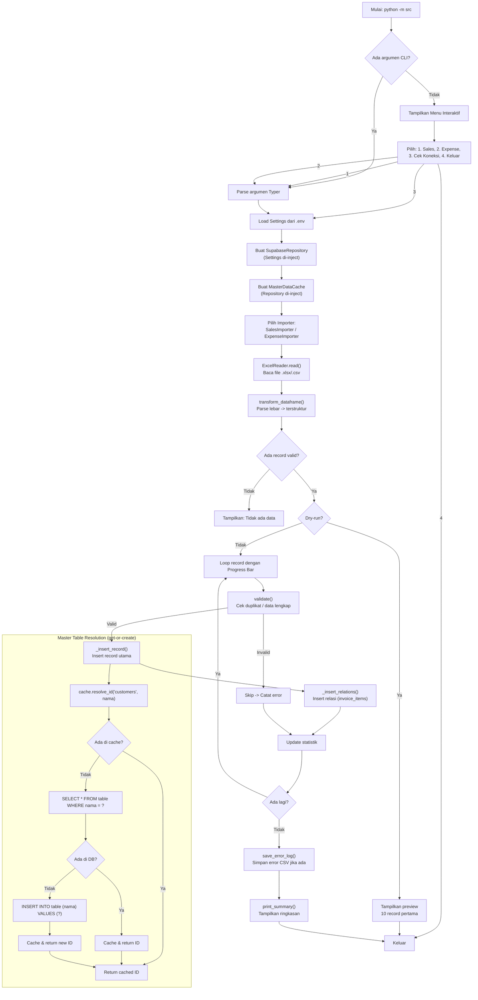

# Supabase Importer

Aplikasi ETL untuk mengimpor data Excel/CSV berformat lebar ke database PostgreSQL Supabase yang sudah dinormalisasi.

**Created by Muhammad Shiddiq Azis**

## Struktur Proyek

```
src/
├── __init__.py
├── __main__.py              # Entry point: python -m src
├── cli/
│   ├── __init__.py
│   ├── app.py                # Typer app, daftar command
│   ├── sales_command.py
│   └── expense_command.py
├── core/
│   ├── __init__.py
│   ├── config.py             # Settings dari environment variables
│   ├── interfaces.py         # ABC: DataRepository, MasterDataCache, Importer
│   ├── models.py             # Dataclasses: Invoice, ExpenseRecord, dst
│   └── exceptions.py         # Custom exceptions
├── importers/
│   ├── __init__.py
│   ├── base_importer.py      # Logika ETL generik (Template Method)
│   ├── sales_importer.py
│   └── expense_importer.py
├── repositories/
│   ├── __init__.py
│   ├── supabase_repository.py
│   └── master_data_cache.py  # Cache generik nama→ID
├── readers/
│   ├── __init__.py
│   └── excel_reader.py       # Baca & validasi file sumber
└── utils/
    ├── __init__.py
    ├── logger.py              # Error log ke CSV
    ├── progress.py            # Wrapper rich.progress
    └── messages.py            # Teks Bahasa Indonesia terpusat
```

## Prasyarat

- Python 3.10+
- Virtual environment disarankan
- Akun Supabase dengan project aktif

## Instalasi

```bash
python -m venv .venv
.venv\Scripts\activate
pip install -r requirements.txt
```

## Konfigurasi Environment Variables

Karena repository ini bersifat **public**, JANGAN pernah commit file `.env` atau kredensial sunggan ke repository.

Untuk lokal, salin `.env.example` menjadi `.env` dan isi dengan kredensial Anda:

```bash
cp .env.example .env
```

Untuk **GitHub CI/CD**, konfigurasikan Secrets di repository Settings:
- `SUPABASE_URL`
- `SUPABASE_SERVICE_ROLE_KEY`

Lihat bagian [GitHub CI/CD](#github-cicd) untuk detailnya.

## Penggunaan

### CLI

```bash
# Bantuan
python -m src --help

# Impor penjualan/invoice
python -m src sales import-data data/invoices.xlsx --sheet "Sheet1"

# Impor pengeluaran
python -m src expense import-expense data/pengeluaran.csv --dry-run
```

### Opsi Umum

- `--sheet / -s` : Nama sheet untuk file Excel
- `--dry-run` : Validasi data tanpa insert ke database
- `--batch-size / -b` : Ukuran batch (default: 100)
- `--verbose / -v` : Output verbose

### Menu Interaktif

Jalankan tanpa argumen untuk menu interaktif Bahasa Indonesia:

```bash
python -m src
```

## Workflow & Flowchart

Berikut adalah alur kerja end-to-end aplikasi ini:



## Konvensi Kode

- **Dependency Injection** lewat ABC `core/interfaces.py`
- **Repository Pattern** untuk akses data Supabase
- **Template Method** di `importers/base_importer.py`
- **Single Responsibility** pada setiap modul
- Semua fungsi publik memiliki type hinting dan docstring

## Testing

```bash
python -m unittest discover -s tests -p "test_*.py" -v
```

## GitHub CI/CD

Repository ini menggunakan GitHub Actions untuk automated testing. Workflow file terletak di `.github/workflows/ci.yml`.

### Setup GitHub Secrets

Agar CI/CD berjalan dengan benar, tambahkan Secrets di repository Anda:

1. Buka repository di GitHub
2. Pergi ke **Settings** > **Secrets and variables** > **Actions**
3. Klik **New repository secret**
4. Tambahkan:
   - `SUPABASE_URL` : URL project Supabase Anda
   - `SUPABASE_SERVICE_ROLE_KEY` : Service role key dari Supabase

### Workflow yang Dijalankan

Pipeline CI/CD akan otomatis:
1. Trigger saat push atau pull request ke branch `main`
2. Setup Python 3.11
3. Install dependencies dari `requirements.txt`
4. Jalankan seluruh test suite
5. Linting dan type checking (jika dikonfigurasi)

### Catatan Keamanan

- File `.env` **tidak boleh** di-commit ke repository. Sudah di-ignore oleh `.gitignore`.
- Credentials disimpan sebagai **GitHub Secrets** dan diinject sebagai environment variables saat CI/CD berjalan.
- File `.env.example` hanya berisi placeholder dan aman untuk di-commit.

## Catatan Penting

- Operasi insert **tidak menggunakan transaction eksplisit**. Kegagalan parsial dapat mengakibatkan data tidak konsisten.
- Master table (`customers`, `sales_persons`, `products`, `coa`, `kategori_pengeluaran`) menggunakan get-or-create: jika nama belum ada, record baru otomatis dibuat.
