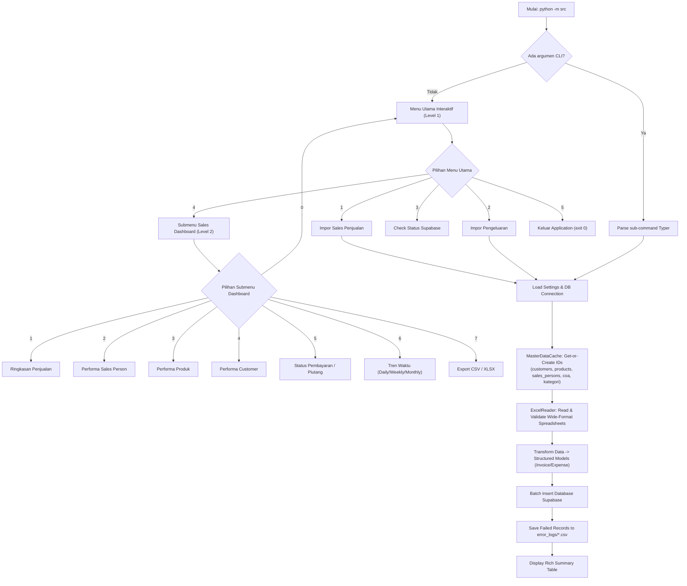

# 🚀 Supabase ETL Importer & Sales Dashboard CLI

Aplikasi **ETL (Extract, Transform, Load)** dan **Sales Dashboard berbasis CLI Python** yang dirancang untuk mengimpor data transaksi Excel/CSV berformat lebar (*wide-format*) ke database PostgreSQL Supabase yang sudah dinormalisasi (3NF), serta menyediakan analitik penjualan real-time.

**Created by Muhammad Shiddiq Azis**

---

## 💡 Reason Behind Building This (Alasan Pembuatan)

Banyak UMKM, bisnis ritel, maupun departemen operasional yang mencatat transaksi penjualan dan pengeluaran harian menggunakan lembar kerja Excel/CSV berformat lebar (*wide-format spreadsheets*). Pendekatan ini sering menimbulkan masalah serius:
1. **Ketidakberaturan Data (*Data Redundancy & Inconsistency*):** Nama pelanggan, produk, dan sales person ditulis berulang kali tanpa dinormalisasi, memicu duplikasi data dan rentan salah ketik (*typo*).
2. **Ketiadaan *Audit Trail* & Validasi Schema:** Sulit melacak record yang gagal diimpor atau memiliki format tanggal/nominal yang rusak.
3. **Kesulitan Analisis Real-Time:** Data mentah di spreadsheet tidak dapat langsung diintegrasikan dengan database relational modern (seperti PostgreSQL Supabase) maupun dashboard analitik performa bisnis.

### 🎯 Solusi yang Dihadirkan Aplikasi Ini:
- **Otomatisasi Normalisasi (Get-or-Create):** Membaca spreadsheet berformat lebar, lalu secara otomatis mencari atau membuat master data (`customers`, `products`, `sales_persons`, `coa`, `kategori_pengeluaran`) di database Supabase secara dinamis.
- **Transaksional Relasional:** Mengonversi baris transaksi menjadi record `invoices`, relasi `invoice_items`, serta `pengeluaran` dengan penanganan Primary Key / Foreign Key dinamis.
- **Fault-Tolerant ETL Engine:** Dilengkapi mode *Dry-Run*, *Top 5 Preview*, indikator *Progress Bar* baris-demi-baris, *Supabase Health Check*, serta pencatatan otomatis record error ke berkas CSV (`error_logs/`).
- **Interactive 2-Level CLI & Direct Dashboard Commands:** Menyediakan dashboard penjualan interaktif (`salesdash`) untuk melihat omzet, COGS, margin, performa sales/produk/customer, piutang, serta tren waktu dengan opsi ekspor ke CSV & Excel (XLSX).

---

## ✨ Fitur Utama

- **📦 ETL Sales & Expense Importer:**
  - Impor berkas `.xlsx` dan `.csv` transaksi penjualan & pengeluaran.
  - Resolusi master data dinamis (`MasterDataCache`) dengan pencarian `TABLE_SCHEMA_MAP`.
  - Dukungan mode `--dry-run` untuk validasi tanpa insert ke DB.
  - Tampilan *Top 5 Data Preview* dan *Progress Bar* baris-demi-baris.
  - Pengecekan status koneksi Supabase di awal eksekusi.
- **📊 Sales Dashboard CLI (`salesdash`):**
  - **Summary:** Ringkasan Total Omzet, Total COGS, Total Margin, Margin %, dan Rata-rata Invoice.
  - **Performa Sales Person:** Analisis penjualan per sales person (termasuk pengelompokan `Unassigned` untuk invoice tanpa sales).
  - **Performa Produk:** Perhitungan margin bersih per produk (`SUM(qty*harga) - SUM(qty*cogs)`).
  - **Performa Customer:** Analisis omzet dan sisa piutang (*outstanding*) per customer.
  - **Status Pembayaran (Piutang):** Daftar invoice terurut tanggal paling lama ke paling baru (*oldest first*) dengan filter status (`lunas`, `belum_lunas`, `sebagian`).
  - **Tren Waktu:** Bucketing tren omzet harian, mingguan, dan bulanan.
  - **Parameterized Filters:** Kombinasi filter (AND logic) untuk `--customer`, `--product`, `--sales`, `--status`, `--min-amount`, `--max-amount`, dan rentang tanggal.
  - **Ekspor Data:** Ekspor hasil analisis ke CSV & Excel (XLSX).
- **📱 Menu Interaktif 2-Level CLI:**
  - **Menu Utama (Level 1):** Impors Sales, Impor Expense, Health Check, Dashboard, Exit.
  - **Submenu Sales Dashboard (Level 2):** Fitur Laporan 1–7 + `0` Kembali ke Menu Utama.

---

## 📂 Struktur Proyek

```text
python-supabase-etl/
├── DATABASE_SCHEMA.md         # Dokumentasi resmi skema tabel database Supabase
├── README.md                  # Dokumentasi utama proyek
├── requirements.txt           # Dependencies Python
├── src/
│   ├── __init__.py
│   ├── __main__.py            # Entry point utama (Interactive Menu 2-Level & CLI launcher)
│   ├── cli/
│   │   ├── app.py             # Registrasi Typer app & sub-commands
│   │   ├── dashboard_command.py # CLI sub-commands Sales Dashboard
│   │   ├── expense_command.py   # CLI sub-commands Expense Importer
│   │   ├── interactive_prompts.py # Komponen UI Rich & prompt interaktif menu
│   │   └── sales_command.py     # CLI sub-commands Sales Importer
│   ├── core/
│   │   ├── config.py          # Settings dari environment variables (.env)
│   │   ├── exceptions.py      # Custom exceptions aplikasi
│   │   ├── interfaces.py      # Abstract Base Classes (ABC)
│   │   └── models.py          # Dataclasses (Invoice, ExpenseRecord, ImportResult)
│   ├── importers/
│   │   ├── base_importer.py   # Logika ETL generik (Template Method Pattern)
│   │   ├── expense_importer.py # Importer khusus data pengeluaran
│   │   └── sales_importer.py   # Importer khusus data penjualan/invoice
│   ├── readers/
│   │   └── excel_reader.py    # Pembaca & pemvalidasi file Excel/CSV
│   ├── reports/
│   │   ├── __init__.py
│   │   ├── exporter.py        # Eksportir hasil ke CSV & Excel (XLSX)
│   │   ├── filter.py          # Parameterized filters (AND logic)
│   │   └── reports.py         # Kalkulasi agregasi murni (Omzet, Margin, Tren)
│   ├── repositories/
│   │   ├── dashboard_repository.py # Repository query dashboard
│   │   ├── master_data_cache.py   # Cache generik get-or-create nama -> ID
│   │   └── supabase_repository.py  # Supabase client wrapper & PostgREST query
│   └── utils/
│       ├── logger.py          # Error logger ke berkas CSV
│       ├── messages.py        # Teks Bahasa Indonesia & konstanta UI
│       └── progress.py        # Wrapper Rich progress bar
└── tests/                     # 156 Automated Test Cases
    ├── test_dashboard_cli.py
    ├── test_dashboard_db.py
    ├── test_dashboard_filters.py
    ├── test_dashboard_menu.py
    ├── test_master_data_cache.py
    ├── test_reports.py
    ├── test_sales_importer.py
    └── ...
```

---

## 🛠️ Prasyarat & Instalasi

### 1. Prasyarat System
- **Python 3.10+** (Direkomendasikan Python 3.11)
- Project aktif di **Supabase** (PostgreSQL)

### 2. Instalasi Dependensi
```bash
# Clone repository
git clone https://github.com/shiddiqeuy/python-supabase-etl.git
cd python-supabase-etl

# Buat virtual environment
python -m venv .venv
.venv\Scripts\activate

# Install requirements
pip install -r requirements.txt
```

### 3. Konfigurasi Environment Variables
Buat berkas `.env` di root direktori (salin dari `.env.example`):
```bash
cp .env.example .env
```
Isi variabel dengan kredensial Supabase Anda:
```env
SUPABASE_URL=https://your-project.supabase.co
SUPABASE_SERVICE_ROLE_KEY=your-supabase-service-role-key
```

---

## 🚀 Penggunaan Aplikasi

### 1. Mode Menu Interaktif (Bahasa Indonesia)
Jalankan aplikasi tanpa argumen untuk membuka Menu Interaktif 2-Level:
```bash
.venv\Scripts\python -m src
```

#### Tampilan Menu Utama:
```text
+----------------------------------------------------+
| 1 | Upload Batch Data Penjualan                    |
| 2 | Upload Batch Pengeluaran                       |
| 3 | Cek Koneksi                                    |
| 4 | Fitur Sales Dashboard                          |
| 5 | Keluar                                         |
+----------------------------------------------------+
```

Memilih opsi `4` akan mengarahkan pengguna ke **Submenu Sales Dashboard**:
```text
+----------------------------------------------------+
| 1 | Ringkasan Penjualan Periode                    |
| 2 | Performa Sales Person                          |
| 3 | Performa Produk                                |
| 4 | Performa Customer                              |
| 5 | Status Pembayaran (Piutang)                    |
| 6 | Tren Waktu (Grafik ASCII)                       |
| 7 | Export Data                                    |
| 0 | Kembali ke Menu Utama                          |
+----------------------------------------------------+
```

### 2. Mode Direct Sub-command CLI (Typer)
Jalankan perintah spesifik secara langsung:

```bash
# Impor Data Penjualan/Invoice
python -m src sales import-data data/invoices.xlsx --sheet "Sheet1"

# Impor Data Pengeluaran (Mode Dry-Run)
python -m src expense import-expense data/pengeluaran.csv --dry-run

# Dashboard Summary Penjualan
python -m src dashboard summary --from 2026-01-01 --to 2026-12-31

# Dashboard Performa Produk dengan Filter Parameter
python -m src dashboard by-product --sales "Budi" --status "belum_lunas"

# Bantuan CLI
python -m src --help
```

---

## 🔄 Workflow & Architecture Flowchart



---

## 🧪 Testing & Automated Verification

Seluruh fungsionalitas ETL dan Sales Dashboard dilindungi oleh test suite otomatis sebanyak **156 Test Cases** dengan tingkat kelolosan **100% PASS**.

Jalankan pengujian unit dan integrasi:
```bash
.venv\Scripts\python -m unittest discover -s tests -p "test_*.py" -v
```

---

## 📝 Konvensi Arsitektur Kode

- **Dependency Injection:** Diterapkan melalui interface di `src/core/interfaces.py`.
- **Repository Pattern:** Memisahkan logika akses data Supabase di `src/repositories/`.
- **Template Method Pattern:** Mematangkan alur kerja ETL di `src/importers/base_importer.py`.
- **Pure Functional Aggregations:** Perhitungan laporan bisnis di `src/reports/reports.py` tidak memiliki efek samping (*side-effect free*).

---

## 📄 Lisensi & Kontribusi

Dibuat oleh **Muhammad Shiddiq Azis**. Proyek ini dibuat untuk meningkatkan efisiensi proses ETL transaksi spreadsheet ke database PostgreSQL Supabase serta menyajikan analitik bisnis yang mudah diakses melalui terminal CLI.
